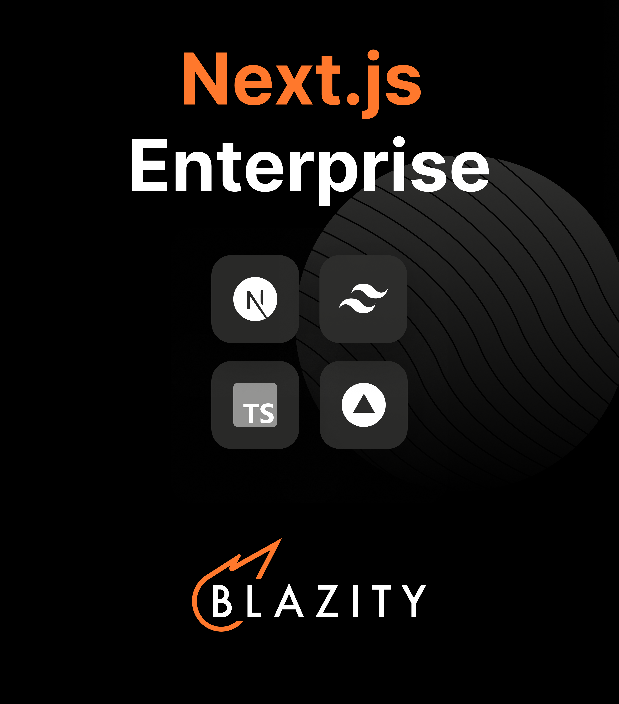

# Next.js Enterprise Boilerplate </br> [![GitHub Actions Workflow Status][check-workflow-badge]][check-workflow-badge-link] [![GitHub License][github-license-badge]][github-license-badge-link] [![GitHub contributors][github-contributors-badge]][github-contributors-badge-link] [![Discord][discord-badge]][discord-badge-link] [![Blazity][made-by-blazity-badge]][made-by-blazity-badge-link]

Welcome to the _Next.js Enterprise Boilerplate_, an open-source template for enterprise projects! It's loaded with features that'll help you build a high-performance, maintainable, and enjoyable app. We've done all the heavy lifting for you, so sit back, relax, and get ready to conquer the world with your incredible app! 🌍

> [!NOTE] > **Blazity** is a group of Next.js/Headless experts. Contact us at [contact@blazity.com](https://blazity.com) if you’d like to talk about your project or just to have a chat with us

## Features

With this template, you get all the awesomeness you need:

- 🏎️ **[Next.js](https://nextjs.org/)** - Fast by default, with config optimized for performance (with **App Directory**)
- 💅 **[Tailwind CSS](https://tailwindcss.com/)** - A utility-first CSS framework for rapid UI development
- ✨ **[ESlint](https://eslint.org/)** and **[Prettier](https://prettier.io/)** - For clean, consistent, and error-free code
- 🛠️ **[Extremely strict TypeScript](https://www.typescriptlang.org/)** - With [`ts-reset`](https://github.com/total-typescript/ts-reset) library for ultimate type safety
- 🚀 **[GitHub Actions](https://github.com/features/actions)** - Pre-configured actions for smooth workflows, including Bundle Size and performance stats
- 💯 **Perfect Lighthouse score** - Because performance matters
- **[Bundle analyzer plugin](https://www.npmjs.com/package/@next/bundle-analyzer)** - Keep an eye on your bundle size
- **Smoke Testing** and **Acceptance Tests** - For confidence in your deployments
- **[Conventional commits git hook](https://www.conventionalcommits.org/)** - Keep your commit history neat and tidy
- **[Absolute imports](https://nextjs.org/docs/advanced-features/module-path-aliases)** - No more spaghetti imports
- **[Health checks](https://kubernetes.io/docs/tasks/configure-pod-container/configure-liveness-readiness-startup-probes/)** - Kubernetes-compatible for robust deployments
- **[Radix UI](https://www.radix-ui.com/)** - Headless UI components for endless customization
- **[CVA](http://cva.style/)** - Create a consistent, reusable, and atomic design system
- **[Renovate BOT](https://www.whitesourcesoftware.com/free-developer-tools/renovate)** - Auto-updating dependencies, so you can focus on coding
- **[Patch-package](https://www.npmjs.com/package/patch-package)** - Fix external dependencies without losing your mind
- **Components coupling and cohesion graph** - A tool for managing component relationships
- **[Automated ChatGPT Code Reviews](https://openai.com/chatgpt)** - **Stay on the cutting edge with AI-powered code reviews!**
- **[Semantic Release](https://github.com/semantic-release/semantic-release)** - for automatic changelog
- **[T3 Env](https://env.t3.gg/)** - Manage your environment variables with ease

## Table of Contents

- [Next.js Enterprise Boilerplate ](#nextjs-enterprise-boilerplate-------)
  - [Features](#features)
  - [Table of Contents](#table-of-contents)
  - [🎯 Getting Started](#-getting-started)
  - [🚀 Deployment](#-deployment)
  - [📃 Scripts Overview](#-scripts-overview)
  - [� State Management](#-state-management)
    - [Zustand](#zustand)
    - [Jotai](#jotai)
    - [Recoil](#recoil)
  - [🤖 ChatGPT Code Review](#-chatgpt-code-review)
  - [💻 Environment Variables handling](#-environment-variables-handling)
  - [🤝 Contribution](#-contribution)
  - [Support](#support)
  - [📜 License](#-license)
  - [Contributors](#contributors)

## 🎯 Getting Started

To get started with this boilerplate, follow these steps:

1. Fork & clone repository:

```bash
## Don't forget to ⭐ star and fork it first :)
git clone https://github.com/<your_username)/next-enterprise.git
```

2. Install the dependencies:

```bash
yarn install --frozen-lockfile
```

3. Run the development server:

```bash
yarn dev
```

4. Open [http://localhost:3000](http://localhost:3000) with your browser to see the result.

5. This project uses a git hook to enforce [conventional commits](https://github.com/qoomon/git-conventional-commits). To install the git hook, run the following command in the root directory of the project:

```sh
brew install pre-commit
pre-commit install -t commit-msg
```

## 🚀 Deployment

Easily deploy your Next.js app with [Vercel](https://vercel.com/new?utm_medium=default-template&filter=next.js&utm_source=github&utm_campaign=next-enterprise) by clicking the button below:

[](https://vercel.com/new/git/external?repository-url=https://github.com/Blazity/next-enterprise)

## 📃 Scripts Overview

The following scripts are available in the `package.json`:

- `dev`: Starts the development server with colorized output
- `build`: Builds the app for production
- `start`: Starts the production server
- `lint`: Lints the code using ESLint
- `lint:fix`: Automatically fixes linting errors
- `prettier`: Checks the code for proper formatting
- `prettier:fix`: Automatically fixes formatting issues
- `analyze`: Analyzes the bundle sizes for Client, Server and Edge environments
- `format`: Formats the code with Prettier

## 💾 State Management

While this boilerplate doesn't include a specific state management library, we believe it's essential for you to choose the one that best suits your project's needs. Here are some libraries we recommend for state management:

### Zustand

[Zustand](https://github.com/pmndrs/zustand) is a small, fast, and scalable state management library. It's designed to be simple and intuitive, making it a great choice for small to medium-sized projects. It's also optimized for bundle size, ensuring minimal impact on your app's performance.

### Jotai

[Jotai](https://github.com/pmndrs/jotai) is an atom-based state management library for React that focuses on providing a minimal and straightforward API. Its atom-based approach allows you to manage your state in a granular way while still being highly optimized for bundle size.

### Recoil

[Recoil](https://recoiljs.org/) is a state management library developed by Facebook, specifically designed for React applications. By utilizing atoms and selectors, Recoil allows you to efficiently manage state and derived state. Its key benefit is the ability to update components only when the state they're subscribed to changes, reducing unnecessary re-renders and keeping your application fast and efficient. Recoil also offers great developer experience with built-in debugging tools.

Choose the library that best fits your requirements and project structure to ensure an efficient state management solution for your application.

## 🤖 ChatGPT Code Review

We've integrated the innovative [ChatGPT Code Review](https://github.com/anc95/ChatGPT-CodeReview) for AI-powered, automated code reviews. This feature provides real-time feedback on your code, helping improve code quality and catch potential issues.

To use ChatGPT Code Review, add an `OPENAI_API_KEY` environment variable with an appropriate key from the OpenAI platform. For setup details, refer to the [Using GitHub Actions](https://github.com/anc95/ChatGPT-CodeReview#using-github-actions) section in the documentation.


## 💻 Environment Variables handling

[T3 Env](https://env.t3.gg/) is a library that provides environmental variables checking at build time, type validation and transforming. It ensures that your application is using the correct environment variables and their values are of the expected type. You’ll never again struggle with runtime errors caused by incorrect environment variable usage.

Config file is located at `env.mjs`. Simply set your client and server variables and import `env` from any file in your project.

```ts
export const env = createEnv({
  server: {
    // Server variables
    SECRET_KEY: z.string(),
  },
  client: {
    // Client variables
    API_URL: z.string().url(),
  },
  runtimeEnv: {
    // Assign runtime variables
    SECRET_KEY: process.env.SECRET_KEY,
    API_URL: process.env.NEXT_PUBLIC_API_URL,
  },
})
```

If the required environment variables are not set, you'll get an error message:

```sh
  ❌ Invalid environment variables: { SECRET_KEY: [ 'Required' ] }
```

## 🤝 Contribution

Contributions are always welcome! To contribute, please follow these steps:

1. Fork the repository.
2. Create a new branch with a descriptive name.
3. Make your changes, and commit them using the [Conventional Commits](https://www.conventionalcommits.org/) format.
4. Push your changes to the forked repository.
5. Create a pull request, and we'll review your changes.

## Support

If you're looking for help or simply want to share your thoughts about the project, we encourage you to join our Discord community. Here's the link: [https://blazity.com/discord](https://blazity.com/discord). It's a space where we exchange ideas and help one another. Everyone's input is appreciated, and we look forward to welcoming you.

<br />
<a href="https://discord.gg/fyWtyNKmfX" style="width: 100%; display: flex; justify-content: center;">
  
</a>
<br />

## 📜 License

This project is licensed under the MIT License. For more information, see the [LICENSE](./LICENSE) file.

## Contributors

<!-- ALL-CONTRIBUTORS-LIST:START - Do not remove or modify this section -->
<!-- prettier-ignore-start -->
<!-- markdownlint-disable -->
<table>
  <tbody>
    <tr>
      <td align="center" valign="top" width="14.28%"><a href="https://bstefanski.com/"><br /><sub><b>Bart Stefanski</b></sub></a><br /><a href="https://github.com/Blazity/next-enterprise/commits?author=bmstefanski" title="Code">💻</a></td>
      <td align="center" valign="top" width="14.28%"><a href="https://github.com/jjablonski-it"><br /><sub><b>Jakub Jabłoński</b></sub></a><br /><a href="#infra-jjablonski-it" title="Infrastructure (Hosting, Build-Tools, etc)">🚇</a></td>
      <td align="center" valign="top" width="14.28%"><a href="https://neg4n.dev/"><br /><sub><b>Igor Klepacki</b></sub></a><br /><a href="https://github.com/Blazity/next-enterprise/commits?author=neg4n" title="Documentation">📖</a></td>
    </tr>
  </tbody>
  <tfoot>
    <tr>
      <td align="center" size="13px" colspan="7">
        
          <a href="https://all-contributors.js.org/docs/en/bot/usage">Add your contributions</a>
        </img>
      </td>
    </tr>
  </tfoot>
</table>

<!-- markdownlint-restore -->
<!-- prettier-ignore-end -->

<!-- ALL-CONTRIBUTORS-LIST:END -->

<!-- Badges and links -->

[check-workflow-badge]: https://img.shields.io/github/actions/workflow/status/blazity/next-enterprise/check.yml?label=check
[github-license-badge]: https://img.shields.io/github/license/blazity/next-enterprise?link=https%3A%2F%2Fgithub.com%2FBlazity%2Fnext-enterprise%2Fblob%2Fmain%2FLICENSE
[github-contributors-badge]: https://img.shields.io/github/contributors/blazity/next-enterprise?link=https%3A%2F%2Fgithub.com%2FBlazity%2Fnext-enterprise%2Fgraphs%2Fcontributors
[discord-badge]: https://img.shields.io/discord/1111676875782234175?color=7b8dcd&link=https%3A%2F%2Fblazity.com%2Fdiscord
[made-by-blazity-badge]: https://img.shields.io/badge/made_by-Blazity-blue?color=FF782B&link=https://blazity.com/
[check-workflow-badge-link]: https://github.com/Blazity/next-enterprise/actions/workflows/check.yml
[github-license-badge-link]: https://github.com/Blazity/next-enterprise/blob/main/LICENSE
[github-contributors-badge-link]: https://github.com/Blazity/next-enterprise/graphs/contributors
[discord-badge-link]: https://blazity.com/discord
[made-by-blazity-badge-link]: https://blazity.com/?utm_source=nextenterprise&utm_medium=github
